<!-- ════════════════════════════════════════════════════════════ -->
<!--  BANNER — commit banner.svg to your repo, then it renders    -->
<!-- ════════════════════════════════════════════════════════════ -->

<div align="center">



<br/><br/>


</div>

<br/>

<!-- ════════════════════════════════════════════════════════════ -->
<!--  INTRO                                                       -->
<!-- ════════════════════════════════════════════════════════════ -->

### &nbsp; `01` &nbsp;—&nbsp; Introduction

I'm a freelancer and creator **SHIV** — I sit between design and engineering, building
products that *look considered* and *work flawlessly*. From conversion-focused websites and
Chrome extensions to AI agents and brand systems, I take ideas from blank canvas to shipped.

I work with new businesses laying their first foundation, and established ones looking to
scale. The approach stays the same: understand the goal, then craft the cleanest path to it.

<br/>

> &nbsp; *"Restraint is the luxury. Detail is the difference."* &nbsp;

<br/>

<!-- ════════════════════════════════════════════════════════════ -->
<!--  SERVICES                                                    -->
<!-- ════════════════════════════════════════════════════════════ -->

### &nbsp; `02` &nbsp;—&nbsp; What I Do

<table width="100%">
<tr>
<td width="50%" valign="top">

**◆ &nbsp;Web & Product**
<br/><sub>Websites, landing pages, web apps, and Chrome extensions — fast, responsive, and pixel-precise.</sub>

</td>
<td width="50%" valign="top">

**◆ &nbsp;AI Agents & Automation**
<br/><sub>Custom agents and workflows that remove busywork and unlock leverage for small teams.</sub>

</td>
</tr>
<tr>
<td width="50%" valign="top">

**◆ &nbsp;Brand & Graphic Design**
<br/><sub>Visual identity, social systems, and thumbnails crafted to stay on-brand and convert.</sub>

</td>
<td width="50%" valign="top">

**◆ &nbsp;Video Editing & Motion**
<br/><sub>Reels, ads, and long-form edits with clean grading, sound, and rhythm.</sub>

</td>
</tr>
</table>

<br/>

<!-- ════════════════════════════════════════════════════════════ -->
<!--  TOOLKIT                                                     -->
<!-- ════════════════════════════════════════════════════════════ -->

### &nbsp; `03` &nbsp;—&nbsp; Toolkit

<sub>**ENGINEERING**</sub>


<sub>**DESIGN & MOTION**</sub>


<sub>**AI & AUTOMATION**</sub>


<sub>**PLATFORM & CLOUD**</sub>


<br/>

<!-- ════════════════════════════════════════════════════════════ -->
<!--  CREDENTIALS                                                 -->
<!-- ════════════════════════════════════════════════════════════ -->

### &nbsp; `04` &nbsp;—&nbsp; Credentials

```
Oracle Cloud Infrastructure                     Oracle · 2021
Data Structures & Algorithms in Java     Great Learning · 2021
Data Structures in C                     Great Learning · 2021
```

<br/>

<!-- ════════════════════════════════════════════════════════════ -->
<!--  STATS                                                       -->
<!-- ════════════════════════════════════════════════════════════ -->

### &nbsp; `05` &nbsp;—&nbsp; Activity

<div align="center">


&nbsp;


<br/>


</div>

<br/>

<!-- ════════════════════════════════════════════════════════════ -->
<!--  CONTACT                                                     -->
<!-- ════════════════════════════════════════════════════════════ -->

### &nbsp; `06` &nbsp;—&nbsp; Get in Touch

Have a project in mind? I take on a limited number of freelance engagements at a time.

&nbsp;&nbsp;[](mailto:your@email.com)
&nbsp;[](https://linkedin.com)
&nbsp;[](https://yoursite.com)

<br/>

<div align="center">
<sub>Crafted with intent · © 2026</sub>
</div>
